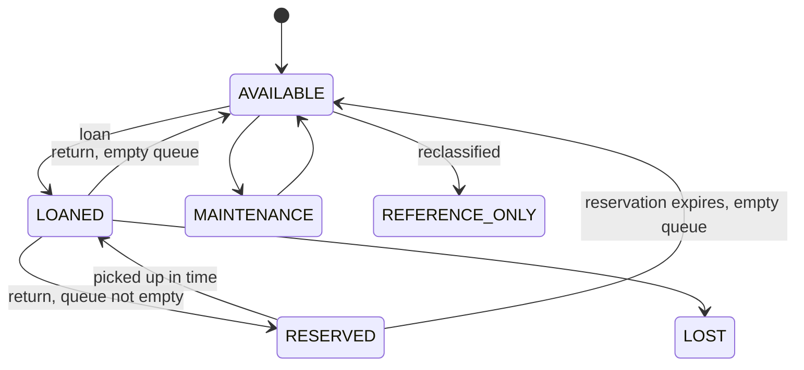

# Copy states

```mermaid
stateDiagram-v2
    [*] --> AVAILABLE
    AVAILABLE --> LOANED: loan
    LOANED --> AVAILABLE: return, empty queue
    LOANED --> RESERVED: return, queue not empty
    RESERVED --> LOANED: picked up in time
    RESERVED --> AVAILABLE: reservation expires, empty queue
    AVAILABLE --> MAINTENANCE
    MAINTENANCE --> AVAILABLE
    LOANED --> LOST
    AVAILABLE --> REFERENCE_ONLY: reclassified
```
