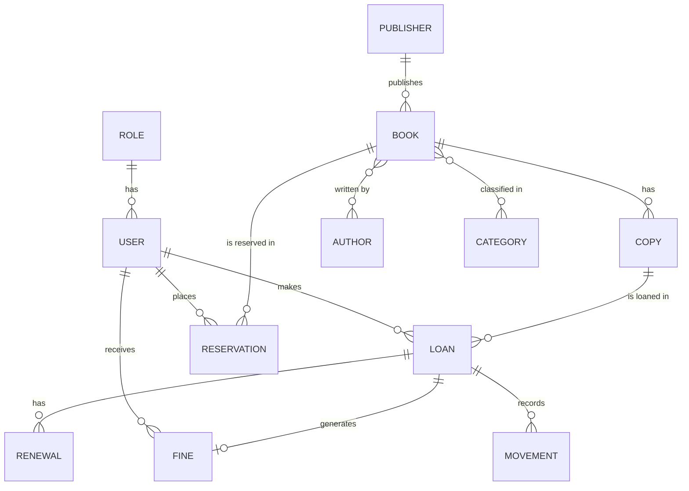

# ERD

```mermaid
erDiagram
    ROLE ||--o{ USER : has
    USER ||--o{ LOAN : makes
    USER ||--o{ RESERVATION : places
    USER ||--o{ FINE : receives
    PUBLISHER ||--o{ BOOK : publishes
    BOOK ||--o{ COPY : has
    BOOK ||--o{ RESERVATION : "is reserved in"
    BOOK }o--o{ AUTHOR : "written by"
    BOOK }o--o{ CATEGORY : "classified in"
    COPY ||--o{ LOAN : "is loaned in"
    LOAN ||--o{ RENEWAL : has
    LOAN ||--o| FINE : generates
    LOAN ||--o{ MOVEMENT : records
```

N:N relationships become `book_authors` and `book_categories`. Schema in 3NF. Script: `backend/src/main/resources/db/migration/V1__initial_schema.sql`.
