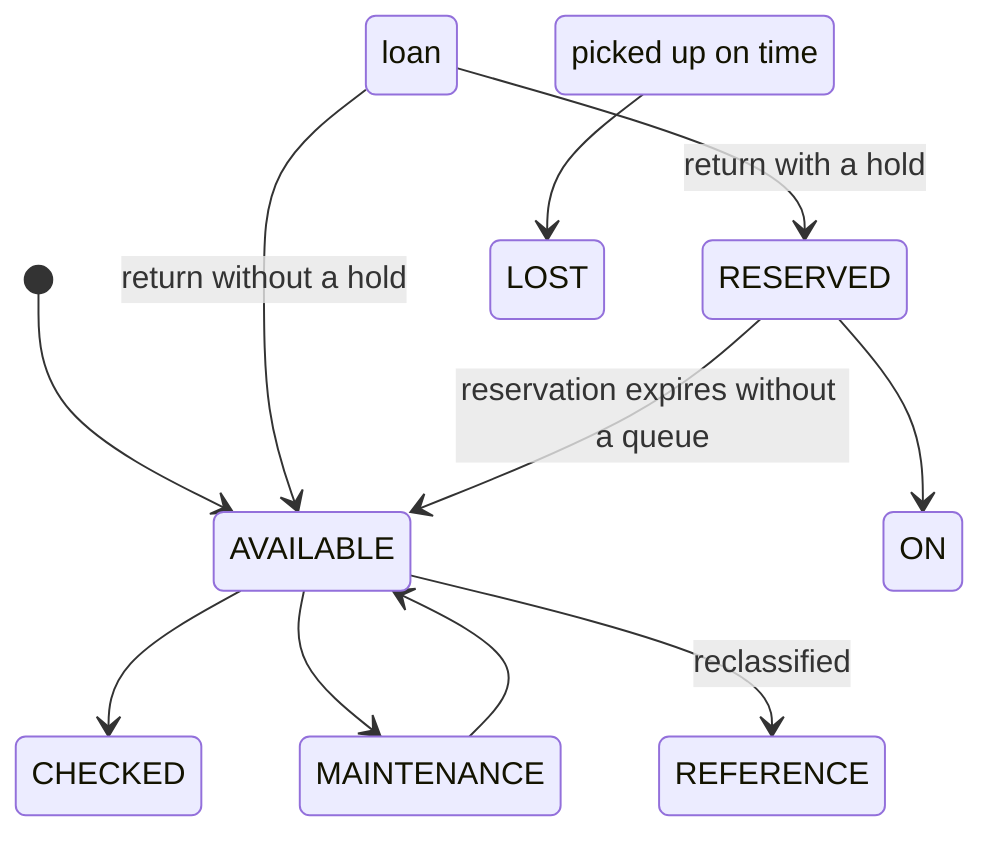

# Item States

```mermaid
stateDiagram-v2
    [*] --> AVAILABLE
    AVAILABLE --> CHECKED OUT: loan
    CHECKED OUT --> AVAILABLE: return without a hold
    CHECKED OUT --> RESERVED: return with a hold
    RESERVED --> ON LOAN: picked up on time
    RESERVED --> AVAILABLE: reservation expires without a queue
    AVAILABLE --> MAINTENANCE
    MAINTENANCE --> AVAILABLE
    ON LOAN --> LOST
    AVAILABLE --> REFERENCE: reclassified
```
