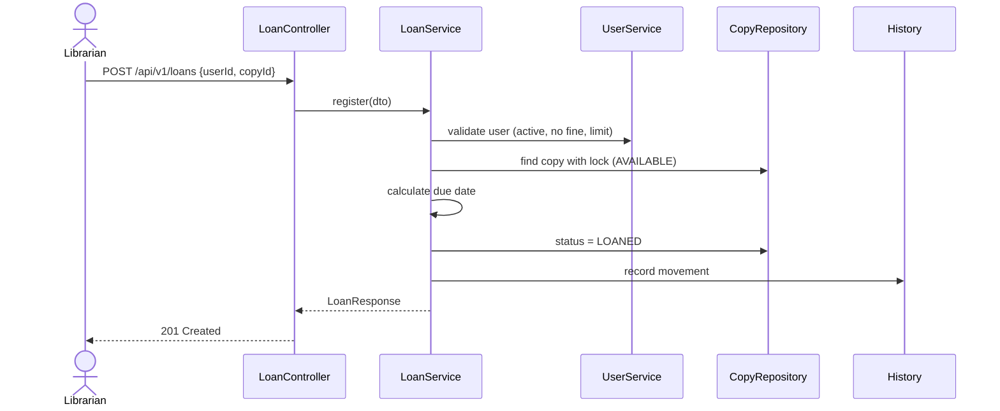

# Sequence - Loan

```mermaid
sequenceDiagram
    actor L as Librarian
    participant C as LoanController
    participant S as LoanService
    participant U as UserService
    participant R as CopyRepository
    participant H as History
    L->>C: POST /api/v1/loans {userId, copyId}
    C->>S: register(dto)
    S->>U: validate user (active, no fine, limit)
    S->>R: find copy with lock (AVAILABLE)
    S->>S: calculate due date
    S->>R: status = LOANED
    S->>H: record movement
    S-->>C: LoanResponse
    C-->>L: 201 Created
```

The pessimistic lock (`SELECT ... FOR UPDATE`) complements the partial unique index `uk_loans_open_copy`.
