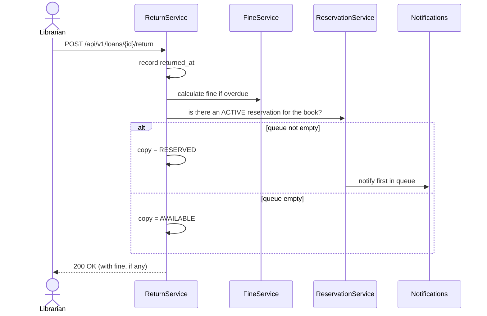

# Sequence - Return

```mermaid
sequenceDiagram
    actor L as Librarian
    participant S as ReturnService
    participant F as FineService
    participant R as ReservationService
    participant N as Notifications
    L->>S: POST /api/v1/loans/{id}/return
    S->>S: record returned_at
    S->>F: calculate fine if overdue
    S->>R: is there an ACTIVE reservation for the book?
    alt queue not empty
        S->>S: copy = RESERVED
        R->>N: notify first in queue
    else queue empty
        S->>S: copy = AVAILABLE
    end
    S-->>L: 200 OK (with fine, if any)
```
