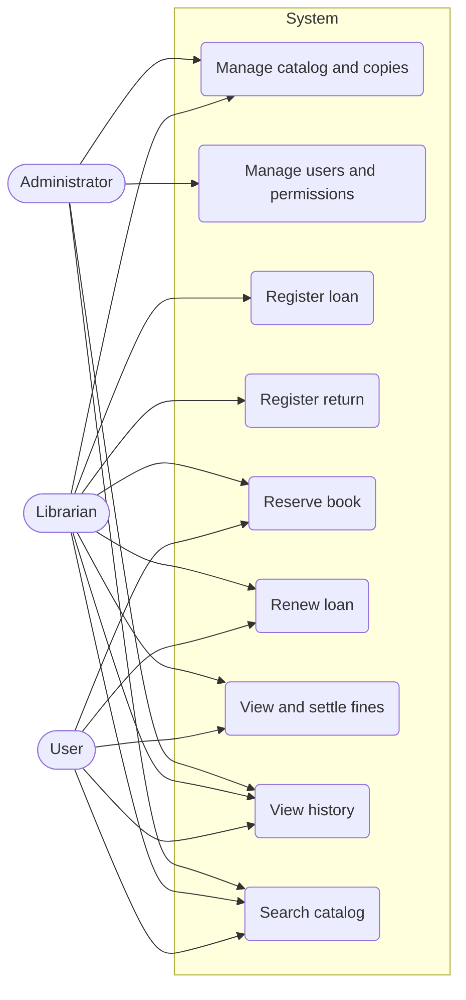

# Use cases

```mermaid
flowchart LR
    ADM([Administrator])
    LIB([Librarian])
    USR([User])
    subgraph System
        UC1(Manage catalog and copies)
        UC2(Manage users and permissions)
        UC3(Register loan)
        UC4(Register return)
        UC5(Reserve book)
        UC6(Renew loan)
        UC7(View and settle fines)
        UC8(View history)
        UC9(Search catalog)
    end
    ADM --> UC1 & UC2 & UC8 & UC9
    LIB --> UC1 & UC3 & UC4 & UC5 & UC6 & UC7 & UC8 & UC9
    USR --> UC5 & UC6 & UC7 & UC8 & UC9
```
